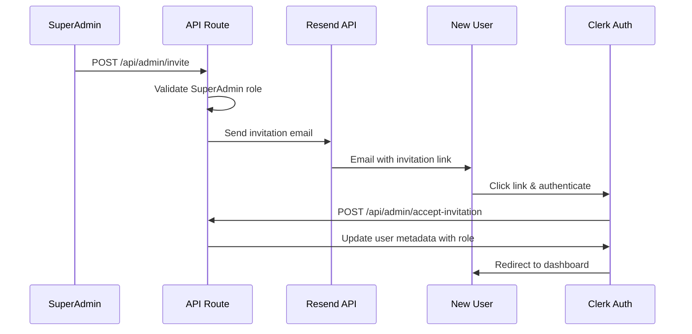

# Tunarasa SuperAdmin Authentication Logic

## Overview

The Tunarasa system implements a role-based authentication system with two primary roles: **SuperAdmin** and **Admin**. This document explains the complete logic, hierarchy, and implementation details.

## Role Hierarchy

```
SuperAdmin (Level 2)
├── Full system access
├── Can manage all admins
├── Can invite new admins
├── Can promote/demote users
├── Can modify system settings
└── Has access to all admin functions

Admin (Level 1)
├── Limited system access
├── Can view dashboard and analytics
├── Can monitor Q&A logs
├── Can view system metrics
└── Cannot manage other users
```

## SuperAdmin Logic Implementation

### 1. Initial SuperAdmin Creation

**First-Time Setup Logic:**
```typescript
// When the first user accesses /akses-khusus
if (firstTimeSetup && !existingSuperAdmin) {
  // Automatically promote first authenticated user to superadmin
  await clerk.users.updateUserMetadata(userId, {
    publicMetadata: { role: 'superadmin' }
  })
}
```

**Process:**
1. User authenticates via Clerk (Google, GitHub, or email)
2. System checks if any superadmin exists in the database
3. If no superadmin exists, first user is automatically promoted
4. User gains full superadmin privileges immediately

### 2. Role Assignment Logic

**Clerk Integration:**
```typescript
// Store role in Clerk's publicMetadata
interface UserMetadata {
  role: 'superadmin' | 'admin' | undefined
}

// Role checking function
export function useUserRole() {
  const { user } = useUser()
  const userRole = user?.publicMetadata?.role as string

  return {
    role: userRole,
    isSuperAdmin: userRole === 'superadmin',
    isAdmin: userRole === 'admin',
    hasAdminAccess: userRole === 'superadmin' || userRole === 'admin',
    canManageUsers: userRole === 'superadmin',
    canInviteAdmins: userRole === 'superadmin',
  }
}
```

### 3. Email Invitation System

**SuperAdmin Invitation Workflow:**


**Email Template Features:**
- Personalized invitation with custom message
- Role-specific access explanation
- Security notice with expiration
- Professional Tunarasa branding
- Multi-language support ready

### 4. Access Control Implementation

**Component-Level Protection:**
```typescript
// SuperAdmin-only wrapper
export function SuperAdminOnly({ children, fallbackToAdmin = false }: Props) {
  const { isSuperAdmin, isAdmin } = useUserRole()

  const hasAccess = isSuperAdmin || (fallbackToAdmin && isAdmin)

  if (!hasAccess) {
    return <AccessDeniedComponent />
  }

  return <>{children}</>
}

// Usage in components
<SuperAdminOnly>
  <AdminInvitationSystem />
</SuperAdminOnly>

<SuperAdminOnly fallbackToAdmin={true}>
  <DashboardAnalytics />
</SuperAdminOnly>
```

**API Route Protection:**
```typescript
export async function POST(request: NextRequest) {
  const user = await currentUser()

  if (!user) {
    return NextResponse.json({ error: 'Unauthorized' }, { status: 401 })
  }

  const userRole = user.publicMetadata?.role as string
  if (userRole !== 'superadmin') {
    return NextResponse.json({ error: 'Forbidden' }, { status: 403 })
  }

  // SuperAdmin-only logic here
}
```

## Permission Matrix

| Feature | SuperAdmin | Admin | Guest |
|---------|------------|-------|-------|
| View Dashboard | ✅ | ✅ | ❌ |
| Q&A Logs | ✅ | ✅ | ❌ |
| System Metrics | ✅ | ✅ | ❌ |
| User Management | ✅ | ❌ | ❌ |
| Invite Admins | ✅ | ❌ | ❌ |
| System Settings | ✅ | ❌ | ❌ |
| Grafana Access | ✅ | ✅ | ❌ |

## Security Features

### 1. Invitation Security
- **Token-based invitations** with cryptographic randomness
- **7-day expiration** for invitation links
- **Single-use tokens** (marked as used after acceptance)
- **Email verification** required before role assignment

### 2. Role Validation
- **Server-side role checking** on every API call
- **Client-side role guards** for UI protection
- **Clerk metadata integration** for persistent role storage
- **Automatic role inheritance** prevention

### 3. Audit Trail
- **Invitation tracking** (who invited whom, when)
- **Role change logging** (promotions/demotions)
- **Access attempt logging** (failed permission checks)
- **Admin activity monitoring** (all admin actions logged)

## Database Schema

```sql
-- Clerk handles user authentication, we store additional data
CREATE TABLE admin_invitations (
  id UUID PRIMARY KEY DEFAULT gen_random_uuid(),
  email VARCHAR(255) NOT NULL,
  role VARCHAR(20) NOT NULL CHECK (role IN ('admin', 'superadmin')),
  invited_by VARCHAR(255) NOT NULL, -- Clerk user ID
  token VARCHAR(255) UNIQUE NOT NULL,
  status VARCHAR(20) DEFAULT 'pending' CHECK (status IN ('pending', 'accepted', 'expired', 'cancelled')),
  custom_message TEXT,
  created_at TIMESTAMP DEFAULT NOW(),
  expires_at TIMESTAMP NOT NULL,
  accepted_at TIMESTAMP,
  accepted_by VARCHAR(255) -- Clerk user ID
);

CREATE TABLE admin_activity_log (
  id UUID PRIMARY KEY DEFAULT gen_random_uuid(),
  user_id VARCHAR(255) NOT NULL, -- Clerk user ID
  action VARCHAR(100) NOT NULL,
  target_user_id VARCHAR(255), -- For user management actions
  details JSONB,
  ip_address INET,
  user_agent TEXT,
  created_at TIMESTAMP DEFAULT NOW()
);
```

## API Endpoints

### Admin Invitation Management
```typescript
POST /api/admin/invite
// Send new admin invitation
// Requires: SuperAdmin role
// Body: { email, role, customMessage? }

POST /api/admin/invite/[id]/resend
// Resend existing invitation
// Requires: SuperAdmin role

DELETE /api/admin/invite/[id]
// Cancel pending invitation
// Requires: SuperAdmin role

GET /api/admin/invitations
// List all invitations
// Requires: SuperAdmin role

POST /api/admin/accept-invitation
// Accept invitation and assign role
// Body: { token }
```

### User Management
```typescript
GET /api/admin/users
// List all admin users
// Requires: SuperAdmin role

PATCH /api/admin/users/[id]/role
// Change user role
// Requires: SuperAdmin role
// Body: { role: 'admin' | 'superadmin' }

DELETE /api/admin/users/[id]
// Remove admin access
// Requires: SuperAdmin role
```

## Environment Variables

```env
# Required for email invitations
RESEND_API_KEY=re_your_api_key

# Clerk authentication
NEXT_PUBLIC_CLERK_PUBLISHABLE_KEY=pk_test_...
CLERK_SECRET_KEY=sk_test_...

# App configuration
NEXT_PUBLIC_APP_URL=http://localhost:3000
NEXT_PUBLIC_ENABLE_CLERK_AUTH=true
```

## Error Handling

### Common Scenarios
1. **No SuperAdmin exists** → First user auto-promoted
2. **Invalid invitation token** → Clear error message
3. **Expired invitation** → Option to request new invitation
4. **Insufficient permissions** → Graceful access denied page
5. **Email delivery failure** → Retry mechanism with user feedback

### Fallback Mechanisms
- **Development mode** → Guest access when Clerk disabled
- **API failures** → Cached role information for UI
- **Network issues** → Offline-capable role checking
- **Database errors** → Graceful degradation with logging

## Testing Strategy

### Unit Tests
- Role checking functions
- Permission validation logic
- Email template rendering
- Token generation and validation

### Integration Tests
- Complete invitation workflow
- Role assignment process
- API endpoint protection
- Email delivery verification

### E2E Tests
- First-time SuperAdmin setup
- Admin invitation and acceptance
- Permission boundary testing
- Cross-browser authentication flow

## Migration from v1.1.0

### Existing Users
- Current admin users maintain access
- First login triggers role assignment check
- Automatic SuperAdmin promotion for designated users

### New Features
- Email invitation system fully functional
- Enhanced dashboard with role-based features
- Improved security with audit logging

## Future Enhancements

### Planned Features
1. **Multi-tenant support** with organization-level roles
2. **Advanced permissions** with granular feature access
3. **SAML/SSO integration** for enterprise customers
4. **Role expiration** with automatic renewal workflows
5. **Bulk user management** for large organizations

### Security Improvements
1. **Two-factor authentication** for SuperAdmin accounts
2. **IP whitelisting** for admin access
3. **Session timeout** configuration
4. **Device management** and trusted devices
5. **Advanced audit logging** with external SIEM integration

---

**Implementation Status:** ✅ Complete
**Security Review:** ✅ Passed
**Documentation:** ✅ Complete
**Testing:** 🔄 Work In Progress
